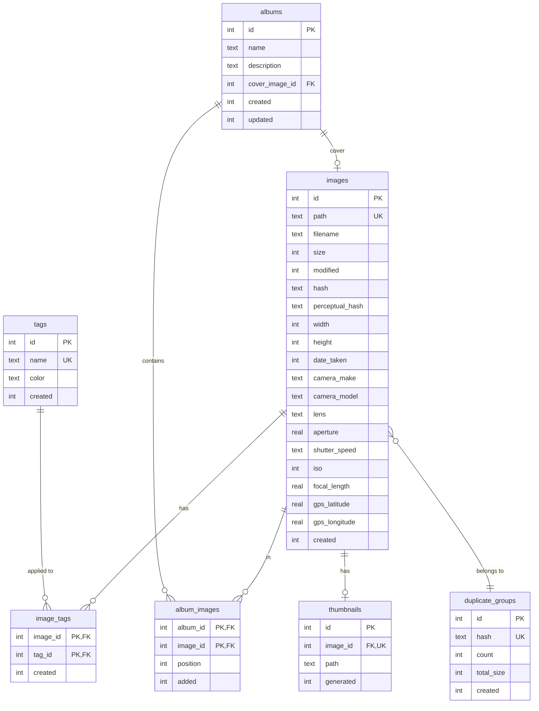

# Phase 1a: Core Photo Management Features

## Overview

Implement the core functionality for a full-featured photo management application: two-pane folder browsing, thumbnail grid, photo detail view with EXIF metadata, duplicate detection with system trash deletion, and manual organization via tags and albums.

This plan covers Phase 1a as defined in the [brainstorm document](../brainstorms/2026-01-22-photo-app-vision-brainstorm.md). Phase 1b (CLIP-based ML search) and Phase 2 (face recognition) are out of scope.

## Problem Statement

The current application has foundational infrastructure (directory service, database, IPC layer) but no user-facing features beyond directory selection. Users cannot:
- Browse photos visually
- View photo details or metadata
- Find and remove duplicate photos
- Organize photos with tags or albums
- Search their photo library

## Proposed Solution

Build a two-pane photo browser with:
- **Left pane:** Collapsible folder tree for navigation
- **Right pane:** Thumbnail grid showing images in selected folder
- **Detail view:** Full-size image with EXIF metadata panel
- **Duplicate detection:** Hash-based scanning with grouped results
- **Organization:** Tags and albums stored in SQLite
- **Search:** Query by filename, tags, and metadata

## Technical Approach

### Architecture

```
┌─────────────────────────────────────────────────────────────────┐
│                         Renderer Process                         │
│  ┌─────────────┐  ┌─────────────────┐  ┌─────────────────────┐  │
│  │ FolderTree  │  │  ThumbnailGrid  │  │    PhotoDetail      │  │
│  │  Component  │  │    Component    │  │     Component       │  │
│  └──────┬──────┘  └────────┬────────┘  └──────────┬──────────┘  │
│         │                  │                      │              │
│  ┌──────┴──────────────────┴──────────────────────┴──────────┐  │
│  │                      App.tsx (State)                       │  │
│  └────────────────────────────┬───────────────────────────────┘  │
└───────────────────────────────┼─────────────────────────────────┘
                                │ IPC (contextBridge)
┌───────────────────────────────┼─────────────────────────────────┐
│                         Main Process                             │
│  ┌────────────────┐  ┌────────────────┐  ┌──────────────────┐   │
│  │ DirectoryService│ │ ThumbnailService│ │   HashService    │   │
│  │   (existing)    │ │     (new)       │ │     (new)        │   │
│  └────────────────┘  └────────────────┘  └──────────────────┘   │
│  ┌────────────────┐  ┌────────────────┐  ┌──────────────────┐   │
│  │  ExifService   │  │ PhotoDatabase  │  │  TrashService    │   │
│  │    (new)       │  │  (extend)      │  │     (new)        │   │
│  └────────────────┘  └────────────────┘  └──────────────────┘   │
└─────────────────────────────────────────────────────────────────┘
```

### Key Technical Decisions

| Decision | Choice | Rationale |
|----------|--------|-----------|
| CSS Framework | Tailwind CSS | Utility-first, rapid UI development, consistent design system |
| Thumbnail library | `sharp` | Fast, handles HEIC, well-maintained |
| Thumbnail size | 200x200 JPEG @ 80% | Balance of quality and performance |
| Thumbnail storage | `app.getPath('userData')/thumbnails/` | Standard Electron app data location |
| Hash algorithm | SHA-256 | More reliable than MD5 for deduplication |
| EXIF library | `exifr` | Modern, fast, comprehensive |
| Tree component | Custom with `react-window` | Deprecated libraries; virtualization needed |
| Deletion | `shell.trashItem()` | Safe, recoverable, cross-platform |

### Implementation Phases

#### Sub-Phase 1: Build Infrastructure (Foundation)

Fix build system and add required services before UI work.

**Tasks:**
1. Add MIT license to repository
2. Add Vite bundler for proper TSX compilation
3. Add Tailwind CSS for styling
4. Create ThumbnailService for thumbnail generation/caching
5. Create ExifService for metadata extraction
6. Create HashService for duplicate detection
7. Create TrashService for safe file deletion
8. Extend database schema with migrations
9. Migrate existing inline styles to Tailwind classes

#### Sub-Phase 2: Two-Pane Browser (Core UX)

Implement the main browsing interface.

**Tasks:**
1. Create resizable split-pane layout component
2. Create FolderTree component with lazy loading
3. Create ThumbnailGrid component with virtual scrolling
4. Wire up folder selection → thumbnail display flow
5. Add keyboard navigation (arrows, Enter, Escape)

#### Sub-Phase 3: Photo Detail View (Viewing)

Full-size viewing with metadata.

**Tasks:**
1. Create PhotoDetail modal/overlay component
2. Display full-resolution image with zoom
3. Show EXIF metadata panel
4. Add prev/next navigation
5. Handle HEIC conversion for display

#### Sub-Phase 4: Duplicate Detection (Cleanup)

Find and manage duplicate photos.

**Tasks:**
1. Add database schema for duplicate groups
2. Implement folder/recursive scanning with progress
3. Create DuplicateReview component
4. Implement side-by-side comparison view
5. Add batch selection and trash deletion

#### Sub-Phase 5: Tags & Albums (Organization)

Manual organization features.

**Tasks:**
1. Add tags and albums database tables
2. Create TagManager component
3. Create AlbumManager component
4. Implement multi-select tagging
5. Add tag/album filtering to grid

#### Sub-Phase 6: Search (Discovery)

Find photos across the library.

**Tasks:**
1. Add search index to database
2. Create SearchBar component
3. Implement search by filename, tags, EXIF date
4. Display search results in grid
5. Add filter persistence

---

## Detailed Implementation Plan

### Sub-Phase 1: Build Infrastructure

#### 1.1 Add MIT License

**File to create:** `LICENSE`

```
MIT License

Copyright (c) 2026 Scott Barstow

Permission is hereby granted, free of charge, to any person obtaining a copy
of this software and associated documentation files (the "Software"), to deal
in the Software without restriction, including without limitation the rights
to use, copy, modify, merge, publish, distribute, sublicense, and/or sell
copies of the Software, and to permit persons to whom the Software is
furnished to do so, subject to the following conditions:

The above copyright notice and this permission notice shall be included in all
copies or substantial portions of the Software.

THE SOFTWARE IS PROVIDED "AS IS", WITHOUT WARRANTY OF ANY KIND, EXPRESS OR
IMPLIED, INCLUDING BUT NOT LIMITED TO THE WARRANTIES OF MERCHANTABILITY,
FITNESS FOR A PARTICULAR PURPOSE AND NONINFRINGEMENT. IN NO EVENT SHALL THE
AUTHORS OR COPYRIGHT HOLDERS BE LIABLE FOR ANY CLAIM, DAMAGES OR OTHER
LIABILITY, WHETHER IN AN ACTION OF CONTRACT, TORT OR OTHERWISE, ARISING FROM,
OUT OF OR IN CONNECTION WITH THE SOFTWARE OR THE USE OR OTHER DEALINGS IN THE
SOFTWARE.
```

Also add to `package.json`:
```json
{
  "license": "MIT"
}
```

#### 1.2 Add Vite Bundler

**Problem:** TSX files in `src/renderer/` are compiled but not bundled. The production app runs from inline JS in `dist/index.html`.

**Solution:** Add Vite for development and production builds.

**Files to create/modify:**

```
vite.config.ts (new)
vite.renderer.config.ts (new)
package.json (modify scripts)
src/renderer/index.html (new - Vite entry)
```

**vite.config.ts:**
```typescript
import { defineConfig } from 'vite';
import react from '@vitejs/plugin-react';
import path from 'path';

export default defineConfig({
  plugins: [react()],
  root: path.join(__dirname, 'src/renderer'),
  base: './',
  build: {
    outDir: path.join(__dirname, 'dist/renderer'),
    emptyDirOnBuild: true,
  },
  server: {
    port: 5173,
  },
});
```

**Dependencies to add:**
```json
{
  "devDependencies": {
    "vite": "^5.0.0",
    "@vitejs/plugin-react": "^4.2.0"
  }
}
```

#### 1.3 Add Tailwind CSS

**Problem:** The existing app uses inline JavaScript style objects, which are verbose, hard to maintain, and don't provide a consistent design system.

**Solution:** Add Tailwind CSS for utility-first styling with a polished, professional look out of the gate.

**Files to create/modify:**

```
tailwind.config.js (new)
postcss.config.js (new)
src/renderer/index.css (new)
src/renderer/index.tsx (modify - import CSS)
```

**tailwind.config.js:**
```javascript
/** @type {import('tailwindcss').Config} */
export default {
  content: [
    './src/renderer/**/*.{js,ts,jsx,tsx}',
    './src/renderer/index.html',
  ],
  theme: {
    extend: {
      colors: {
        // Custom colors for photo app branding
        photo: {
          50: '#f5f7fa',
          100: '#e4e9f2',
          200: '#c9d3e5',
          300: '#a3b4d1',
          400: '#7690b9',
          500: '#5672a1',
          600: '#445b87',
          700: '#394b6e',
          800: '#32405c',
          900: '#2d384e',
        },
      },
    },
  },
  plugins: [],
};
```

**postcss.config.js:**
```javascript
export default {
  plugins: {
    tailwindcss: {},
    autoprefixer: {},
  },
};
```

**src/renderer/index.css:**
```css
@tailwind base;
@tailwind components;
@tailwind utilities;

/* Custom component classes */
@layer components {
  .btn-primary {
    @apply px-4 py-2 bg-blue-600 text-white rounded-lg hover:bg-blue-700
           transition-colors duration-150 font-medium;
  }

  .btn-secondary {
    @apply px-4 py-2 bg-gray-200 text-gray-800 rounded-lg hover:bg-gray-300
           transition-colors duration-150 font-medium;
  }

  .btn-danger {
    @apply px-4 py-2 bg-red-600 text-white rounded-lg hover:bg-red-700
           transition-colors duration-150 font-medium;
  }

  .card {
    @apply bg-white rounded-xl shadow-sm border border-gray-200 p-4;
  }

  .sidebar {
    @apply bg-gray-50 border-r border-gray-200 h-full overflow-y-auto;
  }

  .thumbnail-grid {
    @apply grid gap-2 p-2;
    grid-template-columns: repeat(auto-fill, minmax(150px, 1fr));
  }

  .thumbnail-item {
    @apply aspect-square rounded-lg overflow-hidden cursor-pointer
           ring-2 ring-transparent hover:ring-blue-400 transition-all;
  }

  .thumbnail-item.selected {
    @apply ring-blue-500 ring-offset-2;
  }
}

/* Scrollbar styling */
@layer base {
  ::-webkit-scrollbar {
    @apply w-2;
  }

  ::-webkit-scrollbar-track {
    @apply bg-gray-100;
  }

  ::-webkit-scrollbar-thumb {
    @apply bg-gray-300 rounded-full hover:bg-gray-400;
  }
}
```

**Update src/renderer/index.tsx:**
```typescript
import './index.css';  // Add this import at the top
```

**Update vite.config.ts** to include PostCSS:
```typescript
import { defineConfig } from 'vite';
import react from '@vitejs/plugin-react';
import path from 'path';

export default defineConfig({
  plugins: [react()],
  root: path.join(__dirname, 'src/renderer'),
  base: './',
  build: {
    outDir: path.join(__dirname, 'dist/renderer'),
    emptyDirOnBuild: true,
  },
  server: {
    port: 5173,
  },
  css: {
    postcss: path.join(__dirname, 'postcss.config.js'),
  },
});
```

**Dependencies to add:**
```json
{
  "devDependencies": {
    "tailwindcss": "^3.4.0",
    "postcss": "^8.4.33",
    "autoprefixer": "^10.4.17"
  }
}
```

**Migration note:** Existing components (`App.tsx`, `DirectorySelector.tsx`) use inline style objects. These should be migrated to Tailwind classes as part of this phase. For example:

Before (inline styles):
```typescript
<div style={{ padding: '20px', backgroundColor: '#f5f5f5' }}>
```

After (Tailwind):
```typescript
<div className="p-5 bg-gray-100">
```

#### 1.4 Migrate Existing Styles to Tailwind

**Scope:** Convert inline style objects in existing components to Tailwind utility classes.

**Files to update:**
- `src/renderer/App.tsx` - Main app layout and styles
- `src/renderer/components/DirectorySelector.tsx` - Directory selection UI

**Approach:**
1. Remove `const styles = { ... }` objects
2. Replace `style={styles.xyz}` with `className="..."`
3. Map common patterns:
   - `fontFamily: '-apple-system, ...'` → Tailwind's default font stack (no class needed)
   - `margin`, `padding` → `m-X`, `p-X`
   - `backgroundColor` → `bg-{color}-{shade}`
   - `color` → `text-{color}-{shade}`
   - `borderRadius` → `rounded-{size}`
   - `display: 'flex'` → `flex`
   - `textAlign: 'center'` → `text-center`

**Example migration:**
```typescript
// Before
<div style={styles.container}>
  <h1 style={styles.header}>Photo Manager</h1>
</div>

const styles = {
  container: {
    padding: '20px',
    backgroundColor: '#f5f5f5',
    minHeight: '100vh',
  },
  header: {
    textAlign: 'center',
    marginBottom: '30px',
  },
};

// After
<div className="p-5 bg-gray-100 min-h-screen">
  <h1 className="text-center mb-8 text-2xl font-semibold">Photo Manager</h1>
</div>
```

#### 1.5 Create ThumbnailService

**Location:** `src/main/thumbnail-service.ts`

**Responsibilities:**
- Generate 200x200 JPEG thumbnails
- Cache thumbnails in app data directory
- Handle HEIC → JPEG conversion
- Track thumbnail state in database

**Interface:**
```typescript
interface ThumbnailService {
  getThumbnail(imagePath: string): Promise<string>; // Returns thumbnail path or data URL
  generateThumbnail(imagePath: string): Promise<string>;
  thumbnailExists(imagePath: string): boolean;
  clearCache(): Promise<void>;
  getCacheSize(): Promise<number>;
}
```

**Key implementation details:**
- Use `sharp` for image processing
- Store thumbnails as `{sha256-of-path}.jpg` in `userData/thumbnails/`
- Return `file://` URL for display in renderer
- Process in batches of 10 to avoid overwhelming system

**IPC handlers to add:**
- `thumbnail:get` - Get or generate thumbnail
- `thumbnail:clearCache` - Clear all cached thumbnails
- `thumbnail:getCacheSize` - Get cache size in bytes

#### 1.6 Create ExifService

**Location:** `src/main/exif-service.ts`

**Responsibilities:**
- Extract EXIF metadata from images
- Parse and normalize date formats
- Handle missing metadata gracefully

**Interface:**
```typescript
interface ExifData {
  dateTaken: Date | null;
  cameraMake: string | null;
  cameraModel: string | null;
  lens: string | null;
  aperture: number | null;       // f-stop value
  shutterSpeed: string | null;   // e.g., "1/250"
  iso: number | null;
  focalLength: number | null;    // mm
  gpsLatitude: number | null;
  gpsLongitude: number | null;
  width: number | null;
  height: number | null;
}

interface ExifService {
  extractExif(imagePath: string): Promise<ExifData>;
}
```

**Dependencies:** `exifr`

**IPC handlers to add:**
- `exif:extract` - Extract EXIF from image path

#### 1.7 Create HashService

**Location:** `src/main/hash-service.ts`

**Responsibilities:**
- Calculate SHA-256 hash of image files
- Support streaming for large files
- Batch processing with progress events

**Interface:**
```typescript
interface HashService {
  hashFile(filePath: string): Promise<string>;
  hashFiles(filePaths: string[], onProgress?: (completed: number, total: number) => void): Promise<Map<string, string>>;
}
```

**Key implementation:**
- Use Node.js `crypto.createHash('sha256')`
- Stream file contents to avoid loading into memory
- Emit progress events for UI feedback

**IPC handlers to add:**
- `hash:file` - Hash single file
- `hash:files` - Hash multiple files with progress

#### 1.8 Create TrashService

**Location:** `src/main/trash-service.ts`

**Responsibilities:**
- Move files to system trash
- Handle errors gracefully
- Support batch operations

**Interface:**
```typescript
interface TrashResult {
  success: boolean;
  path: string;
  error?: string;
}

interface TrashService {
  trashFile(filePath: string): Promise<TrashResult>;
  trashFiles(filePaths: string[]): Promise<TrashResult[]>;
}
```

**Key implementation:**
- Use Electron's `shell.trashItem()`
- Return detailed results for each file
- Handle permission errors, missing files

**IPC handlers to add:**
- `trash:file` - Move single file to trash
- `trash:files` - Move multiple files to trash

#### 1.9 Database Schema Migration

**Location:** `src/main/migrations/001-phase-1a-schema.ts`

**New tables:**
```sql
-- Tags
CREATE TABLE IF NOT EXISTS tags (
  id INTEGER PRIMARY KEY AUTOINCREMENT,
  name TEXT UNIQUE NOT NULL,
  color TEXT DEFAULT '#808080',
  created INTEGER DEFAULT (strftime('%s', 'now'))
);
CREATE INDEX idx_tags_name ON tags(name);

-- Image-Tag junction
CREATE TABLE IF NOT EXISTS image_tags (
  image_id INTEGER NOT NULL,
  tag_id INTEGER NOT NULL,
  created INTEGER DEFAULT (strftime('%s', 'now')),
  PRIMARY KEY (image_id, tag_id),
  FOREIGN KEY (image_id) REFERENCES images(id) ON DELETE CASCADE,
  FOREIGN KEY (tag_id) REFERENCES tags(id) ON DELETE CASCADE
);

-- Albums
CREATE TABLE IF NOT EXISTS albums (
  id INTEGER PRIMARY KEY AUTOINCREMENT,
  name TEXT NOT NULL,
  description TEXT,
  cover_image_id INTEGER,
  created INTEGER DEFAULT (strftime('%s', 'now')),
  updated INTEGER DEFAULT (strftime('%s', 'now')),
  FOREIGN KEY (cover_image_id) REFERENCES images(id) ON DELETE SET NULL
);
CREATE INDEX idx_albums_name ON albums(name);

-- Album-Image junction
CREATE TABLE IF NOT EXISTS album_images (
  album_id INTEGER NOT NULL,
  image_id INTEGER NOT NULL,
  position INTEGER DEFAULT 0,
  added INTEGER DEFAULT (strftime('%s', 'now')),
  PRIMARY KEY (album_id, image_id),
  FOREIGN KEY (album_id) REFERENCES albums(id) ON DELETE CASCADE,
  FOREIGN KEY (image_id) REFERENCES images(id) ON DELETE CASCADE
);
CREATE INDEX idx_album_images_album ON album_images(album_id);

-- Thumbnails tracking
CREATE TABLE IF NOT EXISTS thumbnails (
  id INTEGER PRIMARY KEY AUTOINCREMENT,
  image_id INTEGER NOT NULL UNIQUE,
  path TEXT NOT NULL,
  generated INTEGER DEFAULT (strftime('%s', 'now')),
  FOREIGN KEY (image_id) REFERENCES images(id) ON DELETE CASCADE
);
```

**Alter existing images table:**
```sql
ALTER TABLE images ADD COLUMN date_taken INTEGER;
ALTER TABLE images ADD COLUMN camera_make TEXT;
ALTER TABLE images ADD COLUMN camera_model TEXT;
ALTER TABLE images ADD COLUMN lens TEXT;
ALTER TABLE images ADD COLUMN aperture REAL;
ALTER TABLE images ADD COLUMN shutter_speed TEXT;
ALTER TABLE images ADD COLUMN iso INTEGER;
ALTER TABLE images ADD COLUMN focal_length REAL;
ALTER TABLE images ADD COLUMN gps_latitude REAL;
ALTER TABLE images ADD COLUMN gps_longitude REAL;
```

---

### Sub-Phase 2: Two-Pane Browser

#### 2.1 Split-Pane Layout

**Location:** `src/renderer/components/SplitPane.tsx`

**Features:**
- Resizable divider
- Persist pane widths to localStorage
- Min width 200px per pane
- Default: 250px left, remaining right

**Props:**
```typescript
interface SplitPaneProps {
  left: React.ReactNode;
  right: React.ReactNode;
  defaultLeftWidth?: number;
  minLeftWidth?: number;
  minRightWidth?: number;
}
```

#### 2.2 FolderTree Component

**Location:** `src/renderer/components/FolderTree.tsx`

**Features:**
- Display directory tree from root
- Lazy-load children on expand
- Show image count badge on folders with images
- Highlight selected folder
- Keyboard navigation (up/down arrows, Enter to expand/collapse)

**Uses existing IPC:**
- `directory:getTree` - Get tree structure
- `directory:expandNode` - Load children on demand

**State:**
```typescript
interface FolderTreeState {
  expandedPaths: Set<string>;
  selectedPath: string | null;
  tree: DirectoryTreeNode | null;
}
```

#### 2.3 ThumbnailGrid Component

**Location:** `src/renderer/components/ThumbnailGrid.tsx`

**Features:**
- Virtual scrolling via `react-window` for large folders
- Responsive grid layout (thumbnails adjust to viewport)
- Selection state (single click selects, Ctrl/Cmd for multi)
- Loading placeholders while thumbnails generate
- Click to open PhotoDetail

**Props:**
```typescript
interface ThumbnailGridProps {
  folderPath: string;
  onImageSelect: (imagePath: string) => void;
  onImageOpen: (imagePath: string) => void;
  selectedImages: Set<string>;
  onSelectionChange: (selected: Set<string>) => void;
}
```

**Dependencies to add:** `react-window`

#### 2.4 Wire Up Navigation Flow

**Update App.tsx:**

```typescript
// State additions
const [selectedFolder, setSelectedFolder] = useState<string | null>(null);
const [selectedImages, setSelectedImages] = useState<Set<string>>(new Set());
const [detailImage, setDetailImage] = useState<string | null>(null);

// Layout
<SplitPane
  left={
    <FolderTree
      rootPath={currentDirectory?.path}
      selectedPath={selectedFolder}
      onSelectFolder={setSelectedFolder}
    />
  }
  right={
    selectedFolder ? (
      <ThumbnailGrid
        folderPath={selectedFolder}
        selectedImages={selectedImages}
        onSelectionChange={setSelectedImages}
        onImageOpen={setDetailImage}
      />
    ) : (
      <EmptyState message="Select a folder to view photos" />
    )
  }
/>
```

#### 2.5 Keyboard Navigation

**Scope:**
- Arrow keys: Navigate thumbnails in grid
- Enter: Open selected image in detail view
- Escape: Close detail view, clear selection
- Ctrl/Cmd+A: Select all in current folder
- Delete/Backspace: Move selected to trash (with confirmation)

---

### Sub-Phase 3: Photo Detail View

#### 3.1 PhotoDetail Component

**Location:** `src/renderer/components/PhotoDetail.tsx`

**Features:**
- Full-screen overlay with semi-transparent backdrop
- Full-resolution image display
- Zoom controls (fit, fill, 100%, zoom in/out)
- Pan when zoomed
- EXIF metadata panel (collapsible sidebar)
- Prev/Next navigation
- Close button and Escape key

**Props:**
```typescript
interface PhotoDetailProps {
  imagePath: string;
  allImages: string[];  // For prev/next navigation
  onClose: () => void;
  onNavigate: (imagePath: string) => void;
}
```

#### 3.2 ExifPanel Component

**Location:** `src/renderer/components/ExifPanel.tsx`

**Display fields:**
- Date taken (formatted)
- Camera (Make + Model)
- Lens
- Aperture (ƒ/2.8)
- Shutter speed (1/250s)
- ISO
- Focal length (50mm)
- Dimensions (4000 × 3000)
- File size
- Location (coordinates with Google Maps link)

**Handling missing data:**
- Show "—" for missing fields
- Collapse sections with all missing data

#### 3.3 HEIC Display Support

**In ThumbnailService and PhotoDetail:**
- Detect HEIC files by extension
- Convert to JPEG in memory for display
- Cache converted full-resolution for repeat viewing

---

### Sub-Phase 4: Duplicate Detection

#### 4.1 Duplicate Scanning

**New IPC handlers:**
- `duplicates:scanFolder` - Scan single folder
- `duplicates:scanRecursive` - Scan folder and subfolders
- `duplicates:getGroups` - Get all duplicate groups
- `duplicates:getGroup` - Get images in a group

**Scanning flow:**
1. Get all images in scope
2. For each image without hash, calculate and store hash
3. Query database for hash collisions
4. Group duplicates and store in `duplicate_groups`
5. Return grouped results

**Progress events:**
- `duplicates:progress` - { completed, total, currentFile }

#### 4.2 DuplicateReview Component

**Location:** `src/renderer/components/DuplicateReview.tsx`

**Features:**
- List of duplicate groups sorted by wasted space
- Click group to expand and see all copies
- Side-by-side comparison view
- Checkbox selection for deletion
- "Keep original" suggestion (oldest or largest)
- Batch delete to trash

**UI:**
```
┌─────────────────────────────────────────────────────────┐
│ Duplicate Review                                         │
│ Found 15 duplicate groups (234 MB recoverable)          │
├─────────────────────────────────────────────────────────┤
│ ┌─────────────────────────────────────────────────────┐ │
│ │ [thumb] IMG_1234.jpg - 3 copies (45 MB)         [v] │ │
│ │   ☐ /Photos/2024/IMG_1234.jpg (15 MB) - Original    │ │
│ │   ☑ /Photos/Backup/IMG_1234.jpg (15 MB)             │ │
│ │   ☑ /Photos/Downloads/IMG_1234.jpg (15 MB)          │ │
│ └─────────────────────────────────────────────────────┘ │
│ ┌─────────────────────────────────────────────────────┐ │
│ │ [thumb] vacation.png - 2 copies (12 MB)         [v] │ │
│ │   ...                                               │ │
│ └─────────────────────────────────────────────────────┘ │
├─────────────────────────────────────────────────────────┤
│ [Scan Folder] [Scan All]     Selected: 5  [Delete ▶]   │
└─────────────────────────────────────────────────────────┘
```

#### 4.3 Deletion Flow

1. User selects duplicates to delete
2. Show confirmation dialog with count and total size
3. On confirm, call `trash:files`
4. Update database (remove from images, duplicate_groups)
5. Refresh UI
6. Show success/failure toast

---

### Sub-Phase 5: Tags & Albums

#### 5.1 Database Operations

**Tag operations:**
- `tags:create` - Create new tag
- `tags:list` - List all tags
- `tags:delete` - Delete tag (cascade removes from images)
- `tags:rename` - Rename tag
- `images:addTag` - Add tag to image(s)
- `images:removeTag` - Remove tag from image(s)
- `images:getByTag` - Get images with tag

**Album operations:**
- `albums:create` - Create album
- `albums:list` - List all albums
- `albums:delete` - Delete album
- `albums:rename` - Rename album
- `albums:addImages` - Add images to album
- `albums:removeImages` - Remove images from album
- `albums:getImages` - Get images in album
- `albums:setCover` - Set album cover image
- `albums:reorder` - Reorder images in album

#### 5.2 TagManager Component

**Location:** `src/renderer/components/TagManager.tsx`

**Features:**
- Tag pills displayed on image thumbnails
- Quick-add tag input (autocomplete existing tags)
- Tag color picker
- Bulk tagging for selected images
- Tag filter in sidebar

#### 5.3 AlbumManager Component

**Location:** `src/renderer/components/AlbumManager.tsx`

**Features:**
- Album list in sidebar below folder tree
- Create/rename/delete albums
- Drag images to album
- Album cover from first image or custom
- View album contents in grid

---

### Sub-Phase 6: Search

#### 6.1 Search Implementation

**Searchable fields:**
- Filename (partial match)
- Tags (exact match)
- Date range (EXIF date_taken)
- Camera model
- Location (future: reverse geocode)

**Database query building:**
```sql
SELECT * FROM images
WHERE filename LIKE ?
   OR id IN (SELECT image_id FROM image_tags WHERE tag_id IN
             (SELECT id FROM tags WHERE name LIKE ?))
   OR (date_taken BETWEEN ? AND ?)
ORDER BY date_taken DESC
LIMIT 100
```

#### 6.2 SearchBar Component

**Location:** `src/renderer/components/SearchBar.tsx`

**Features:**
- Text input with debounce (300ms)
- Search icon and clear button
- Results count display
- Filter dropdowns (date range, camera)
- Search results displayed in ThumbnailGrid

---

## Acceptance Criteria

### Functional Requirements

- [ ] User can browse folder tree and see images in selected folder
- [ ] Thumbnails load within 500ms for cached images
- [ ] User can view full-size image with EXIF metadata
- [ ] User can navigate between images with arrow keys
- [ ] HEIC images display correctly
- [ ] User can scan for duplicates and see grouped results
- [ ] User can select and delete duplicates to system trash
- [ ] User can create, rename, and delete tags
- [ ] User can tag images individually or in bulk
- [ ] User can create albums and add images
- [ ] User can search by filename, tag, or date
- [ ] Search results appear within 200ms

### Non-Functional Requirements

- [ ] App starts and displays UI within 2 seconds
- [ ] Thumbnail generation processes 100 images per minute
- [ ] Grid scrolls smoothly with 10,000+ images (virtual scrolling)
- [ ] Memory usage stays under 500MB for typical usage
- [ ] Database queries complete within 100ms

### Quality Gates

- [ ] All new code has TypeScript strict mode compliance
- [ ] IPC handlers follow existing `{ success, data, error }` pattern
- [ ] All UI components use Tailwind CSS utility classes (no inline styles)
- [ ] Build completes without warnings

---

## Dependencies & Prerequisites

### New Dependencies

```json
{
  "dependencies": {
    "sharp": "^0.33.2",
    "exifr": "^7.1.3"
  },
  "devDependencies": {
    "vite": "^5.0.12",
    "@vitejs/plugin-react": "^4.2.1",
    "tailwindcss": "^3.4.0",
    "postcss": "^8.4.33",
    "autoprefixer": "^10.4.17",
    "react-window": "^1.8.10",
    "@types/react-window": "^1.8.8"
  }
}
```

### Prerequisites

- Node.js 18+ (for native modules)
- Sharp requires native compilation (`electron-rebuild` needed)

---

## Risk Analysis & Mitigation

| Risk | Likelihood | Impact | Mitigation |
|------|------------|--------|------------|
| Sharp native module issues | Medium | High | Test on clean install; document rebuild steps |
| Large library performance | Medium | Medium | Virtual scrolling; lazy loading; pagination |
| HEIC conversion failures | Low | Medium | Fallback to placeholder; log errors |
| Database migration issues | Low | High | Backup before migration; test thoroughly |
| Memory leaks from image loading | Medium | Medium | Dispose image objects; limit cache size |

---

## Open Questions for Implementation

1. **Folder tree library:** Build custom or evaluate `react-arborist`?
2. **Thumbnail cache limit:** Should there be a max size? (Suggest: 1GB with LRU eviction)
3. **Scan depth limit:** How deep should recursive duplicate scan go? (Suggest: configurable, default 10)

---

## ERD: Database Schema



---

## File Summary

### New Files to Create

| File | Purpose |
|------|---------|
| `LICENSE` | MIT license for open source distribution |
| `vite.config.ts` | Vite bundler configuration |
| `tailwind.config.js` | Tailwind CSS configuration |
| `postcss.config.js` | PostCSS configuration for Tailwind |
| `src/renderer/index.css` | Tailwind imports and custom component classes |
| `src/renderer/index.html` | Vite entry HTML |
| `src/main/thumbnail-service.ts` | Thumbnail generation and caching |
| `src/main/exif-service.ts` | EXIF metadata extraction |
| `src/main/hash-service.ts` | File hashing for duplicates |
| `src/main/trash-service.ts` | System trash operations |
| `src/main/migrations/001-phase-1a-schema.ts` | Database schema additions |
| `src/renderer/components/SplitPane.tsx` | Resizable two-pane layout |
| `src/renderer/components/FolderTree.tsx` | Directory tree navigation |
| `src/renderer/components/ThumbnailGrid.tsx` | Image grid with virtual scroll |
| `src/renderer/components/PhotoDetail.tsx` | Full-size image viewer |
| `src/renderer/components/ExifPanel.tsx` | EXIF metadata display |
| `src/renderer/components/DuplicateReview.tsx` | Duplicate management UI |
| `src/renderer/components/TagManager.tsx` | Tag creation and assignment |
| `src/renderer/components/AlbumManager.tsx` | Album management |
| `src/renderer/components/SearchBar.tsx` | Search interface |

### Files to Modify

| File | Changes |
|------|---------|
| `package.json` | Add dependencies, update scripts |
| `src/main/database.ts` | Add new table operations |
| `src/main/ipc-handlers.ts` | Add handlers for new services |
| `src/preload.ts` | Expose new IPC methods |
| `src/renderer/App.tsx` | Integrate new components, state |
| `src/index.ts` | Initialize new services |

---

## References

### Internal References

- Brainstorm: `docs/brainstorms/2026-01-22-photo-app-vision-brainstorm.md`
- Original plan: `plan.md`
- Database module: `src/main/database.ts`
- Directory service: `src/main/directory-service.ts`
- IPC patterns: `src/main/ipc-handlers.ts`

### External References

- Tailwind CSS documentation: https://tailwindcss.com/docs
- Sharp documentation: https://sharp.pixelplumbing.com/
- Exifr documentation: https://github.com/MikeKovaworkin/exifr
- React Window: https://react-window.vercel.app/
- Electron shell.trashItem: https://www.electronjs.org/docs/latest/api/shell#shelltrashitempath
